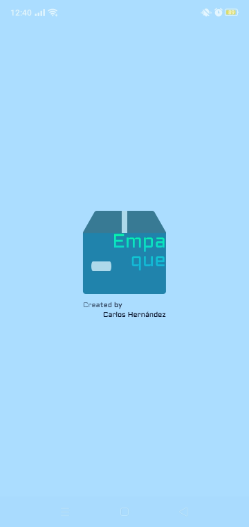
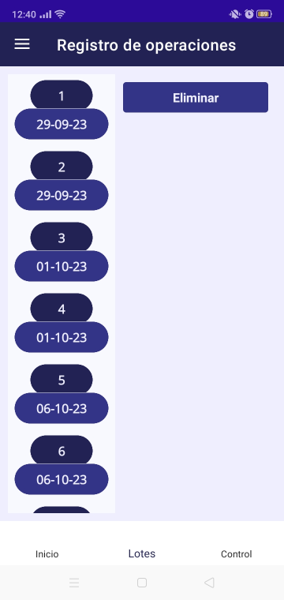
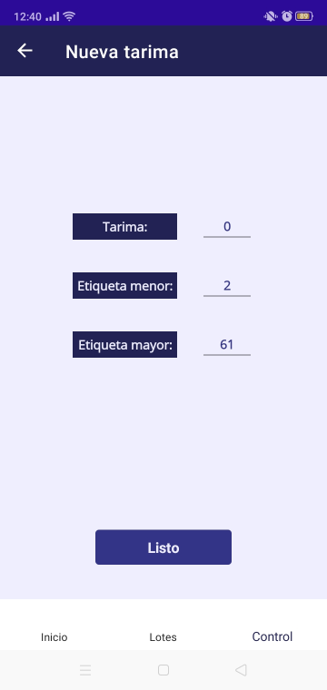
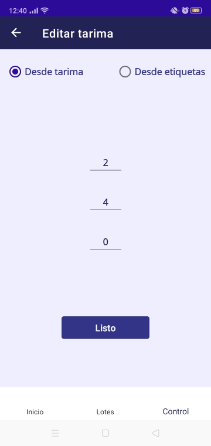
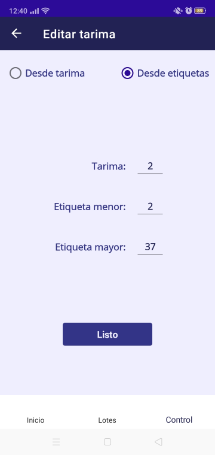
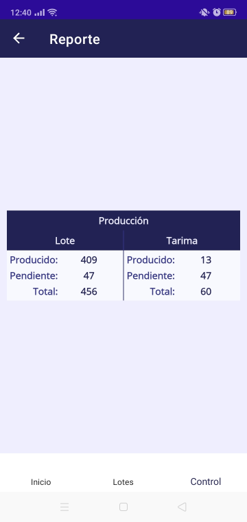

# Descripción

Sistema para **monitorear** la **producción** de una empresa y **automatizar** las **operaciones cognitivas** relacionadas a esta. Destinada a ser una herramienta auxiliar en el área de empaque de la empresa **"Erika de Reynosa S.A. De C.V."**

# Pantalla arranque

# Pantalla de inicio

# Pantalla de inicio (paso 2)

# Pantalla de inicio (paso 3)

# Pantalla de lotes

# Pantalla de control

# Pantalla de control de etiquetas

# Pantalla de nuevo paquete de etiquetas

# Pantalla de edición de tarima (método 1)

# Pantalla de edición de tarima (método 2)

# Pantalla de reporte

# Pantalla de báscula

